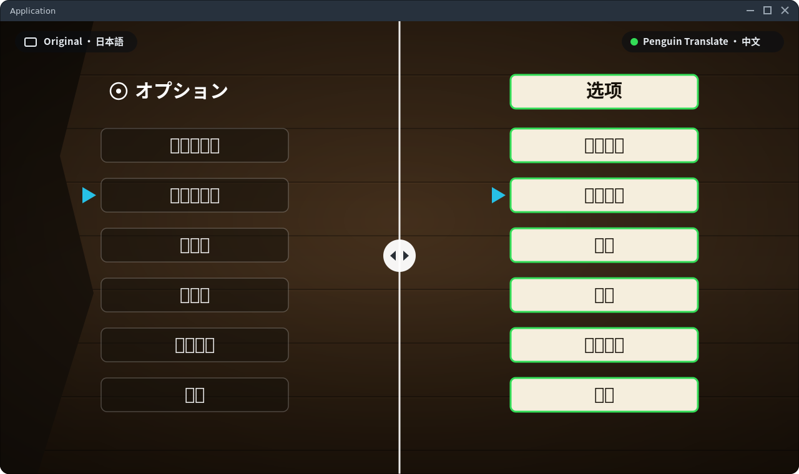
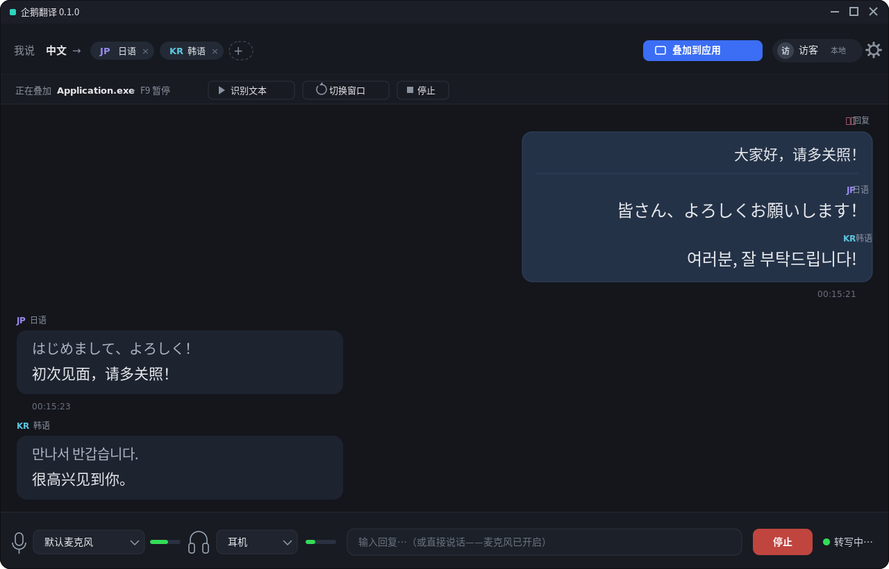

# 企鹅翻译（Translation Overlay）

面向 Windows 的实时翻译工具——翻译屏幕上的文字、系统播放的声音，以及麦克风里的语音。

- **窗口翻译**：选定任意窗口，自动识别画面中的文字并实时翻译，再以可点击穿透的悬浮窗叠加显示（支持桌面与 SteamVR），按快捷键随时开关。
- **音频字幕**：实时听写并翻译电脑正在播放的声音，自动生成字幕条；看视频、开会、玩游戏都跟得上。
- **麦克风翻译**：对着麦克风说话即可实时转写并翻译，还附带假名 / 罗马音注音，练习口语也很方便。

