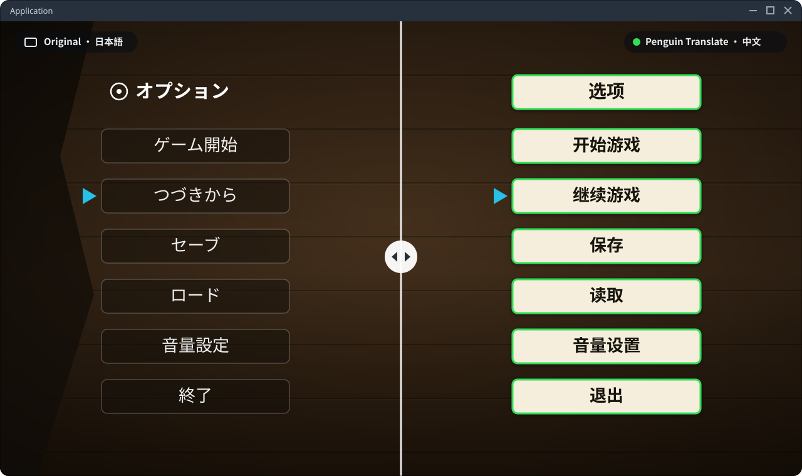
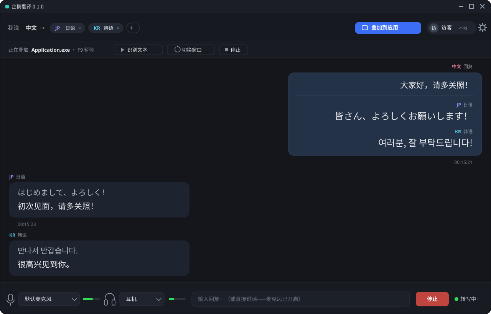
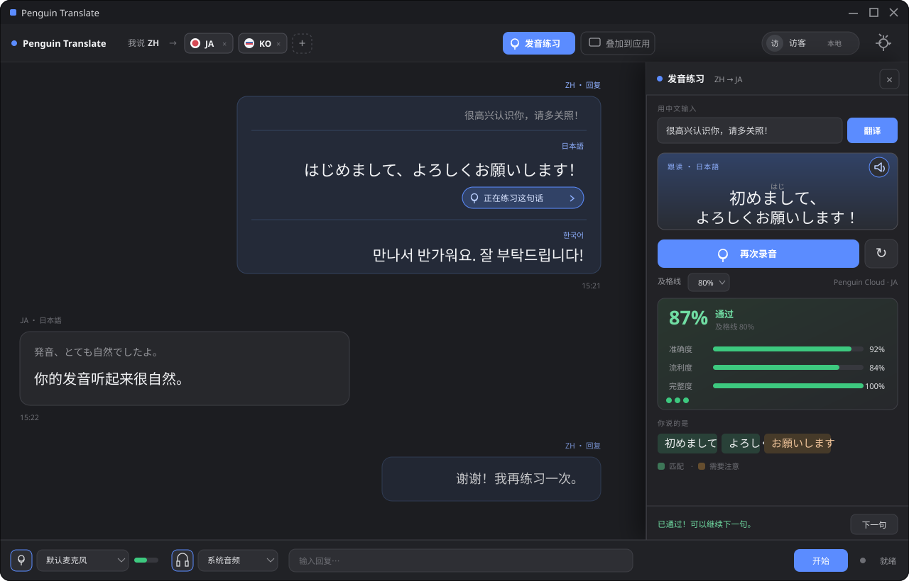

# 企鵝翻譯（Translation Overlay）

[简体中文](README.md) · [繁體中文](README.zh-TW.md) · [粵語](README.yue.md) · [日本語](README.ja.md) · [Français](README.fr.md) · [Português](README.pt.md)

企鵝翻譯係一個 Windows 即時翻譯應用程式。佢可以翻譯其他視窗入面嘅文字、將系統音訊轉錄同翻譯成字幕、翻譯咪高峰輸入，亦可以用譯文練習發音。

## 功能

- **視窗翻譯**：揀咗視窗之後，應用程式會辨認同翻譯畫面文字，再將譯文疊加喺原本個視窗上。浮動圖層唔會截住滑鼠操作，支援桌面同 SteamVR，亦可以用快捷鍵開關。
- **系統音訊字幕**：轉錄同翻譯電腦播放緊嘅聲音，喺獨立字幕列顯示原文同譯文。
- **咪高峰翻譯**：即時轉錄同翻譯咪高峰收到嘅語音。
- **發音練習**：播放譯文嘅示範語音，錄低朗讀再提供評分。日文、中文同韓文可以顯示相應嘅閱讀輔助。

## 發音練習

喺對話入面揀「練習呢句」，應用程式會將相應譯文載入練習畫面。播放示範語音之後，撳住錄音掣朗讀，放開就可以睇總分同辨認結果。用 Penguin Cloud 評分嗰陣，畫面亦會顯示逐詞回饋、準確度、流利度同完整度。

## 可選語言

應用程式嘅語言選擇器包括英文、日文、簡體中文、繁體中文、粵語、吳語、韓文、西班牙文、法文、德文、意大利文、葡萄牙文同俄文。
